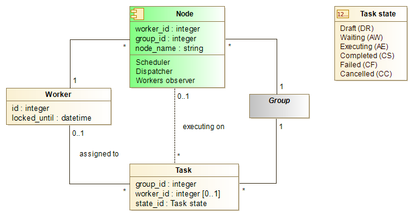

# Features
* a task being ran as an OS process
* supports tasks queue with priority and process limit per node
* fully database driven (a worker and task can be controlled through table row)
* task can be cancelled by changing its state in the table row (OS process terminated)
* task can be scheduled at a time or with interval
* uses postgres NOTYFY events in opposite to pooling (instant changes discovery, less request)
* supports clustering (several nodes per group)
* supports faiover (several nodes per worker)

# Class diagramm

# Task lifecycle

