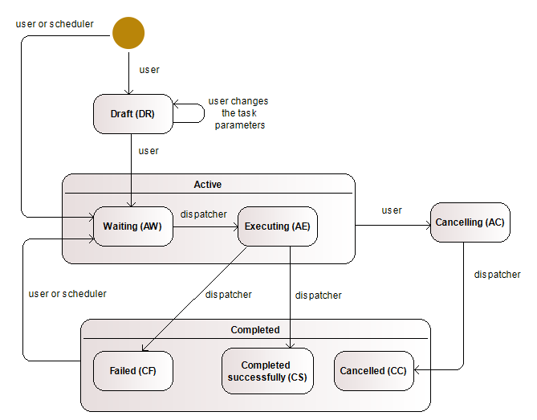

# Features
* a task runs as an OS process
* supports tasks queue with priority and process limit per node
* fully database driven (a worker and task can be controlled through the table row)
* a task can be cancelled by changing its state in the table row (OS process terminated)
* a task can be scheduled at a time or with interval
* uses postgres NOTYFY feature in opposite to pooling (instant changes discovery, less request)
* [supports clustering)(doc/clustering.md)
* [supports faiover](doc/failover.md)

# Class diagramm

# Task lifecycle

