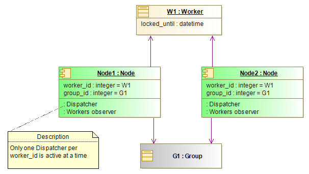

# Worker failover
* Several Nodes can reference the same Worker
* Nodes use "worker" table to set an exclusive lock to only one of the Node's dispatcher be active at a time
* Workers observer of a Node reads periodicically all worker table rows to detect any worker's fail state (see below). Recover procedure is lunched for each worker failed.

# Worker fail state detection and recovery
Worker is in fail state when (worker.locked_until > now()) is true.\
Worker observer running on each Noode lunches recovery procedure when (worker.locked_until + config.failed_worker_recovery_delay > now()) is true.\
Recovery procedure is:
- aquire exclusive lock for the worker
- call recover_worker_tasks(worker_id) stored procedure
- reset worker.active flag
- release lock

# Worker failover with two Nodes

